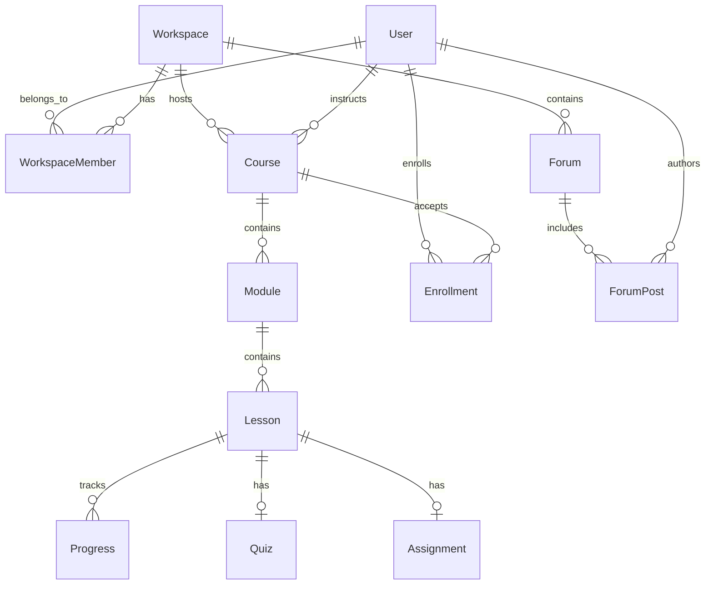

# GurukulX 🚀

> **GurukulX** is a modern, enterprise-grade, multi-tenant Learning Management System (LMS) and Learning Platform engineered as a high-performance **Turborepo monorepo**. Built with **Next.js 16**, **React 19**, **NestJS 11**, **Prisma ORM**, and integrated with **Reticle Proof Layer** for automated agentic quality assurance.

---

## 📑 Table of Contents

- [Features](#-features)
- [Monorepo Architecture](#-monorepo-architecture)
- [Tech Stack](#-tech-stack)
- [Directory Structure](#-directory-structure)
- [Getting Started](#-getting-started)
  - [Prerequisites](#prerequisites)
  - [Installation](#installation)
  - [Environment Setup](#environment-setup)
  - [Database Initialization](#database-initialization)
- [Development Commands](#-development-commands)
- [In-App Verification (Reticle)](#-in-app-verification-reticle)
- [Database Schema & Data Model](#-database-schema--data-model)
- [Contributing](#-contributing)
- [License](#-license)

---

## ✨ Features

### 🏢 Multi-Tenant Workspaces
- **Custom Branding & Domains**: Workspace-level customization with custom domain routing and custom JSON branding themes.
- **Role-Based Access Control (RBAC)**: Support for workspace roles (`ADMIN`, `INSTRUCTOR`, `STUDENT`) via `WorkspaceMember`.
- **API Key & Integration Layer**: Generate and manage workspace API keys for external integrations.

### 📚 Course & Curriculum Management
- **Hierarchical Course Builder**: Organize content cleanly into **Courses**, **Modules**, and **Lessons**.
- **Interactive Drag & Drop**: Module and lesson ordering using `@hello-pangea/dnd`.
- **Rich Lesson Types**: Support for Rich Text content, Cloudflare R2 video streaming, Quizzes, and Assignments.

### ✍️ Assessment & Evaluation System
- **Interactive Quizzes**: Auto-graded quizzes with configurable passing scores (`passingScore`) and attempt tracking.
- **Assignment Submissions**: Submission portal for student assignments with instructor grading capabilities.
- **Progress Tracking**: Real-time completion tracking per user per lesson (`Progress` model).

### 👥 Community & Learning Pathways
- **Discussion Forums**: Integrated Q&A and forum posts per workspace to drive student engagement.
- **Learning Programs**: Group related courses into structured multi-course certification tracks.
- **Media & Resource Library**: Centralized asset management for images, video attachments, and downloadable files.

---

## 🏗 Monorepo Architecture

GurukulX is structured as a Turborepo monorepo containing distinct applications and shared packages:

```
GurukulX/
├── apps/
│   ├── api/             # NestJS 11 Backend API Service
│   └── web/             # Next.js 16 (App Router) Frontend Web Application
└── packages/
    ├── database/        # Prisma Schema, Client & DB Utilities
    ├── ui/              # Shared UI Component Library & Design System
    ├── types/           # Shared TypeScript Interfaces & Types
    ├── eslint-config/   # Shared ESLint Configuration Rules
    └── typescript-config/# Base TypeScript Configuration Files
```

---

## 🛠 Tech Stack

### Frontend (`apps/web`)
- **Framework**: Next.js 16 (App Router + Turbopack) & React 19
- **Styling**: Tailwind CSS v3, PostCSS, Autoprefixer
- **UI Primitives**: Radix UI (`@radix-ui/react-dialog`, `select`, `tooltip`, `collapsible`, etc.)
- **Animations & Drag-and-Drop**: Framer Motion, `@hello-pangea/dnd`
- **Icons**: Lucide React
- **HTTP Client**: Axios

### Backend (`apps/api`)
- **Framework**: NestJS 11 (Express platform)
- **Language**: TypeScript 5.7+
- **Validation**: `class-validator` & `class-transformer`
- **Reactive Extensions**: RxJS
- **Testing**: Jest & Supertest

### Database & Shared Packages (`packages/*`)
- **ORM**: Prisma ORM 5.22
- **Database Driver**: SQLite (Dev) / PostgreSQL compatible
- **Monorepo Engine**: Turborepo v2.9+
- **Verification Layer**: Reticle Proof Layer (`@reticlehq/react`, `@reticlehq/next`)

---

## 🚀 Getting Started

### Prerequisites

Ensure your system meets the following requirements:
- **Node.js**: `>= 18.0.0` (v20+ recommended)
- **Package Manager**: `npm >= 11.0.0` (or `pnpm` / `yarn`)

### Installation

Clone the repository and install all workspace dependencies:

```bash
git clone https://github.com/your-org/GurukulX.git
cd GurukulX
npm install
```

### Environment Setup

Copy the example environment files for the workspace applications:

```bash
# Copy root env
cp .env.example .env

# Copy app env files
cp apps/web/.env.example apps/web/.env
cp apps/api/.env.example apps/api/.env
```

Configure your local environment variables in `apps/web/.env` and `apps/api/.env` as needed.

### Database Initialization

Generate the Prisma client and push the schema to your local database:

```bash
# Generate Prisma Client
npm run --workspace=@repo/database build

# Push database schema (SQLite dev.db)
cd packages/database
npx prisma db push
```

---

## 💻 Development Commands

Start all frontend and backend services concurrently using Turborepo:

```bash
# Start all dev servers (Frontend at http://localhost:3000, Backend API watching)
npm run dev
```

To run individual workspaces directly:

```bash
# Run only the Frontend web app
npm run dev --workspace=web

# Run only the Backend API app
npm run dev --workspace=api
```

### Additional Scripts

| Command | Description |
| :--- | :--- |
| `npm run dev` | Runs dev servers for all apps in parallel (`turbo run dev`) |
| `npm run build` | Builds all packages and applications for production |
| `npm run lint` | Runs ESLint across all packages and apps |
| `npm run check-types` | Executes TypeScript type checking (`tsc --noEmit`) |
| `npm run format` | Formats all TS, TSX, and Markdown files using Prettier |

---

## 🛡 In-App Verification (Reticle)

GurukulX is integrated with **[Reticle](https://reticle.sh)** — an in-app dev SDK and proof layer for AI agents and automated verification.

### Key Capabilities
- **Runtime Proof**: Drives the live Next.js application headlessly to inspect real network requests, store states, console logs, and DOM element attributes.
- **Verification Command**: Run `/reticle` or `npx @reticlehq/server status` to inspect daemon status on bridge port `4400`.
- **Saved Skill**: Reusable Reticle rules and capabilities scaffold are defined in [.agents/skills/reticle/SKILL.md](file:///d:/My%20projects/GurukulX/GurukulX/.agents/skills/reticle/SKILL.md) and [AGENTS.md](file:///d:/My%20projects/GurukulX/GurukulX/AGENTS.md).

---

## 📊 Database Schema & Data Model

The database schema defined in `packages/database/prisma/schema.prisma` models a complete educational ecosystem:



---

## 🤝 Contributing

Contributions are welcome! Please follow these guidelines:

1. Create a feature branch: `git checkout -b feature/amazing-feature`
2. Ensure code standards: `npm run lint` and `npm run check-types`
3. Verify user-facing flows using Reticle verification before submitting PRs.
4. Commit your changes and push to your branch.

---

## 📜 License

This project is licensed under the **UNLICENSED** / Proprietary license. All rights reserved.
